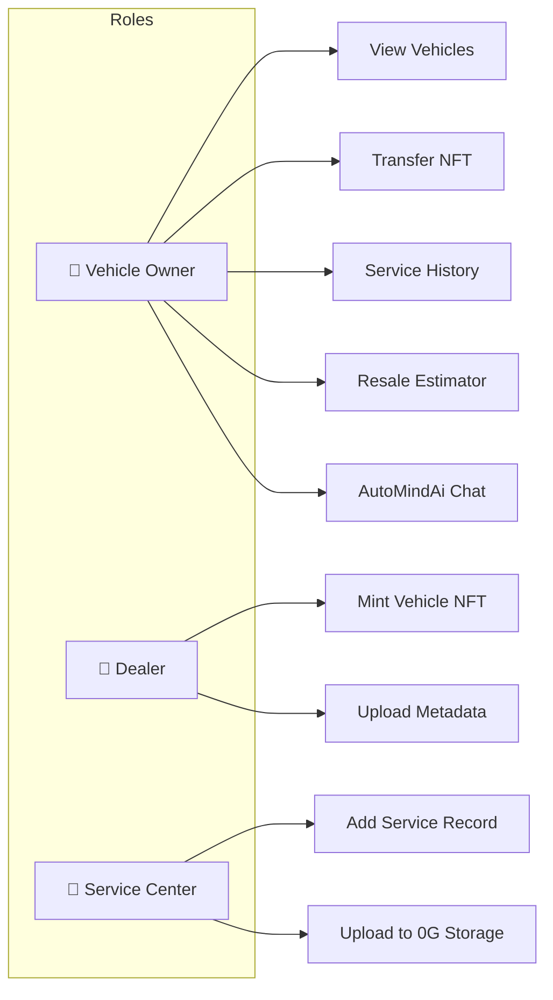
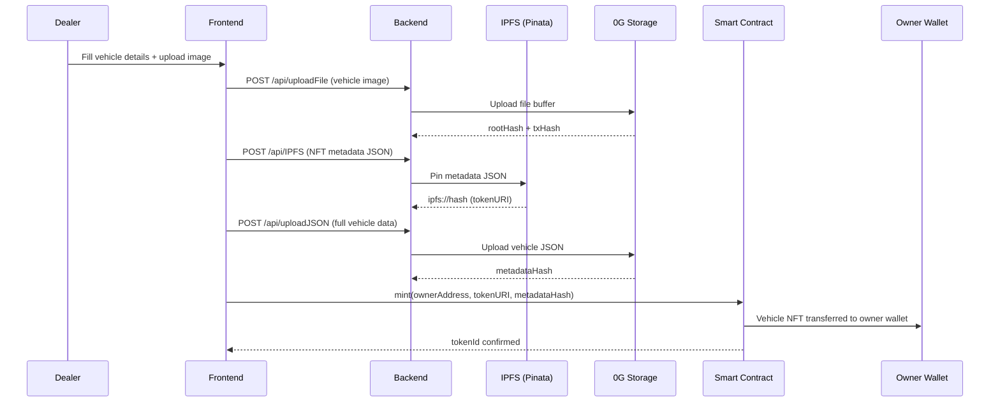
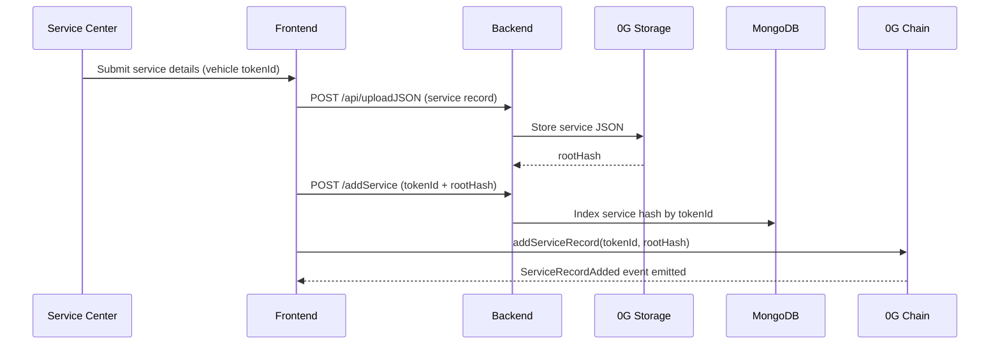
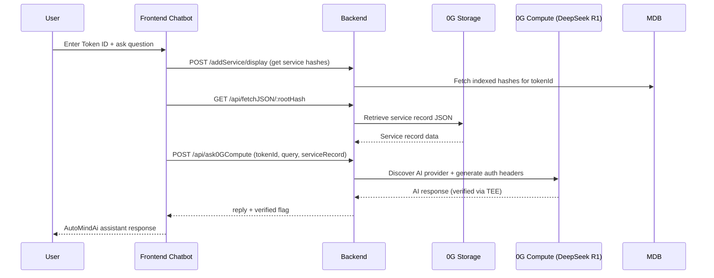
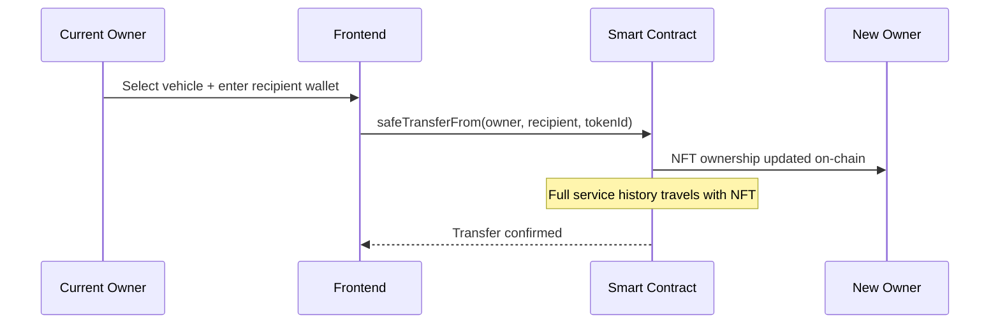

# AutoMindAi – Decentralized Vehicle Intelligence Network

## One-Line Description

AutoMindAi is an AI-powered decentralized vehicle intelligence network that creates tamper-proof vehicle identities, service histories, and lifecycle insights using 0G Chain, Storage, and Compute.

---

## Project Summary

AutoMindAi addresses the lack of transparency and trust in vehicle ownership and maintenance records.

Today, vehicle data is fragmented across dealerships, service centers, insurers, and vehicle owners. Service records can be lost or manipulated, making resale verification difficult and creating trust issues for buyers and financial institutions.

AutoMindAi creates a decentralized ecosystem where every vehicle receives a verifiable digital identity. Vehicle ownership, service records, diagnostics, and lifecycle information are secured using 0G infrastructure.

The platform enables:

* Vehicle NFT minting by authorized dealers
* Immutable service history management
* Decentralized vehicle record storage
* AI-powered maintenance predictions
* Vehicle health scoring
* Resale verification and trust scoring
* Vehicle intelligence assistant (AutoMindAi)

By combining blockchain, decentralized storage, and AI, AutoMindAi establishes a trusted source of truth for vehicle lifecycle management.

---

## Problem Statement

Vehicle records are currently:

* Scattered across multiple stakeholders
* Difficult to verify during resale
* Vulnerable to manipulation and fraud
* Not interoperable between organizations
* Lacking intelligent predictive insights

This creates inefficiencies for:

* Vehicle owners
* Buyers
* Dealers
* Service centers
* Insurance providers
* Fleet operators

---

## Why AutoMindAi?

The global automotive ecosystem lacks a universal and trusted vehicle identity layer.

AutoMindAi introduces a decentralized framework where vehicle data becomes:

* Verifiable
* Transparent
* Immutable
* AI-enhanced
* Accessible across stakeholders

The result is greater trust, lower fraud, improved maintenance planning, and stronger resale markets.

---

## 0G Integration Plan

### 0G Chain

**Purpose:**

* Vehicle NFT ownership management
* Dealer verification
* Service center registration
* On-chain metadata references
* Vehicle ownership transfers

**Data Stored:**

* Vehicle NFT references
* Ownership events
* Service record hashes
* Verification proofs

---

### 0G Storage

**Purpose:**

* Vehicle metadata storage
* Service records
* Diagnostic reports
* Maintenance history
* Vehicle documents

**Benefits:**

* Decentralized storage
* Tamper resistance
* High scalability
* Long-term persistence

---

### 0G Compute

**Purpose:**

* Predictive maintenance analysis
* Vehicle health scoring
* Resale value estimation
* AI-powered diagnostics
* Intelligent vehicle assistant

**Benefits:**

* Decentralized AI inference
* Scalable compute resources
* Verifiable AI outputs

---

### Future Agentic ID Integration

Every vehicle will evolve into an intelligent vehicle agent capable of:

* Monitoring vehicle health
* Recommending maintenance schedules
* Generating resale intelligence
* Supporting insurance assessments

This will leverage 0G's Agentic ID standard to create intelligent, transferable vehicle identities.

---

## Technical Architecture

| Layer | Technology | Responsibility |
|-------|-----------|----------------|
| **Presentation** | React, Vite, Tailwind CSS, Redux | Dashboard UI, wallet connection, role-based views |
| **Application** | Node.js, Express.js | Auth, API gateway, 0G SDK orchestration |
| **Blockchain** | 0G Chain (EVM), Solidity ERC-721 | Vehicle NFT minting, ownership, on-chain record hashes |
| **Decentralized Storage** | 0G Storage | Vehicle metadata, service records, diagnostic JSON |
| **Decentralized AI** | 0G Compute (DeepSeek R1) | Vehicle assistant, resale estimation, diagnostics |
| **Off-Chain Index** | MongoDB | User accounts, service hash indexing, session data |

---

### Smart Contract — `SimpleVehicleNFT`

Deployed on **0G Chain** as an ERC-721 token (`VPASS` — Vehicle Passport).

| Function | Description |
|----------|-------------|
| `mint(to, tokenURI, metadataHash)` | Dealer mints a vehicle NFT to buyer's wallet |
| `addServiceRecord(tokenId, json)` | Appends a service record hash/JSON reference on-chain |
| `tokenURI(tokenId)` | Returns IPFS/0G metadata URI for the vehicle |
| `getServiceRecordCount(tokenId)` | Returns total service records linked to a vehicle |
| `getServiceRecordAt(tokenId, index)` | Fetches a specific service record by index |

**On-Chain Data:** Token ownership, token URI, metadata hash, service record references  
**Off-Chain Data (0G Storage):** Full vehicle JSON, service details, images, diagnostic reports

---

### User Roles & Access

---

### Core Data Flows

#### 1. Vehicle NFT Minting (Dealer → Owner)

#### 2. Service Record Addition (Service Center)

#### 3. AI Vehicle Assistant — AutoMindAi (0G Compute)

#### 4. Vehicle Ownership Transfer

---

## Development Roadmap

### Wave 1 – Project Scoping & Architecture

* Finalize system architecture
* Design smart contract structure
* Define 0G integrations
* Create technical documentation
* Develop UI/UX wireframes

### Wave 2 – Testnet Prototype

* Vehicle NFT minting
* 0G Storage integration
* Dealer onboarding workflow
* Basic dashboard deployment

### Wave 3 – Mainnet Deployment

* Deploy smart contracts on 0G Mainnet
* Complete ownership workflows
* Service record verification system

### Wave 4 – AI Intelligence Layer

* Predictive maintenance engine
* Vehicle health scoring
* Resale intelligence module

### Wave 5 – Growth & Agentic Vehicles

* Agentic ID integration
* AI vehicle assistant
* Early user onboarding
* Partnership expansion

---
